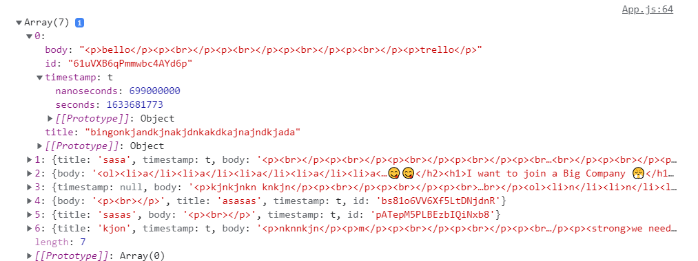

npm install - To install dependencies
 

npm start - To run it
 

Libraries Used:
- @material-ui/core 
- @material-ui/icons 
- react-quill 
- firebase 
 

Simple UI app with awesome features
 

Future Work: 
Login / Authentication functionality

First Look: 

Firebase Note structure: 

Code has references for the snippets that were taken from net like HTML Tags removal regex expression was taken from stackoverflow
